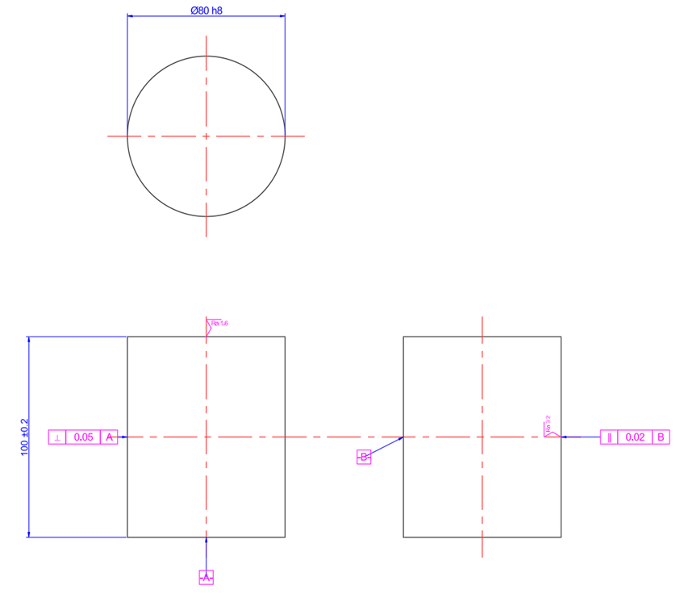
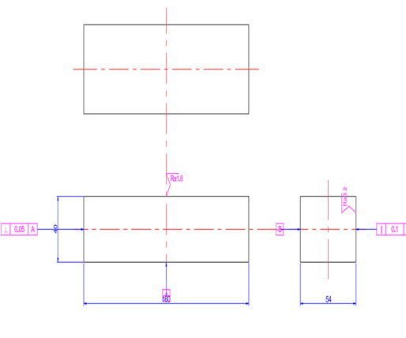
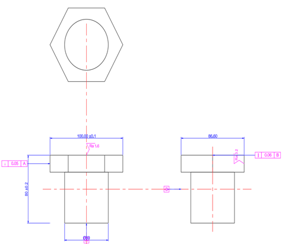
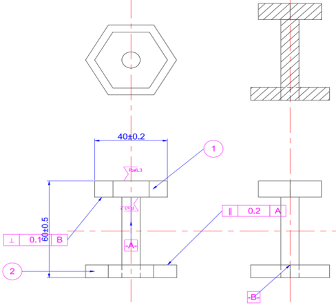

# CAD-Daedalus

[](https://opensource.org/licenses/MIT)
[](https://github.com/Wuuuz001/CAD-Daedalus)
[](https://github.com/Wuuuz001/CAD-Daedalus)

**CAD-Daedalus is a Neuro-Symbolic Framework for Standardized and Verifiable Engineering Design, bridging the gap between the probabilistic nature of Large Language Models (LLMs) and the deterministic requirements of Computer-Aided Design (CAD).** [cite: 1, 2, 5]

The official repository for the paper: **CAD-Daedalus: A Neuro-Symbolic Framework for the Standardized Engineering Design**.

**[Access the Repository](https://github.com/Wuuuz001/CAD-Daedalus)** 

---

## 📖 About The Project

Integrating Large Language Models (LLMs) into Computer-Aided Design (CAD) presents a fundamental challenge: LLMs operate on probabilistic correlations, while engineering demands deterministic precision and adherence to strict standards. End-to-end generative approaches often result in designs that are physically unrealizable, unstable, or non-compliant with manufacturing constraints, requiring costly manual rework.

**CAD-Daedalus** addresses this problem by architecturally reframing the LLM's role. Instead of being an unreliable end-to-end generator, the LLM acts as an **interactive proposal engine** within a verifiable and deterministic framework. Our core innovation is the decoupling of probabilistic intent parsing from deterministic geometric synthesis, ensuring that all generated outputs are verifiably correct and compliant with engineering standards. 


## ✨ Key Features

Daedalus introduces several core contributions to the field of AI-assisted engineering:

-   **✅ Verifiable Neuro-Symbolic Framework:** Separates the LLM's probabilistic reasoning from a deterministic, symbolic compiler, guaranteeing reliability and compliance with engineering rules.
-   **🤝 Multimodal Human-AI Interaction:** A dialogue-driven refinement process that transforms the design workflow from a brittle, one-shot attempt into a robust, collaborative partnership between the user and the AI.
-   **🔧 Extensibility and Generalization:** The framework can generalize across dimensions (2D to 3D) and synergistically integrate other state-of-the-art generative models (like GNNs or Diffusion models) without requiring extensive pre-training.

## 🖼️ Gallery: Examples of Generated Designs

CAD-Daedalus can generate a wide spectrum of engineering artifacts, from basic geometric primitives to complex, multi-component assemblies, all with precise dimensional and tolerance annotations.

| Cylinder (2D & 3D) | Cuboid (2D & 3D) | Hexagonal Screw (2D & 3D) | Screw-Nut Assembly (2D & 3D) |
| :----------------: | :--------------: | :-----------------------: | :--------------------------: |
|  |  |  |  |

## 🚀 Getting Started

To get a local copy up and running, follow these simple steps.

### Prerequisites

Before you begin, ensure you have the following installed on your system:

- **Node.js**: Version 18.x or later. You can download it from [nodejs.org](https://www.google.com/url?sa=E&q=https%3A%2F%2Fnodejs.org%2F).
- **npm**: This is the Node Package Manager and comes included with Node.js.
- **Git**: For cloning the repository.
- **An OpenAI API Key**: You need an API key from OpenAI or a compatible provider to use the LLM features.

### Installation & Setup

The setup process involves configuring both the backend server and the frontend application.

1. **Clone the repository:**

   First, clone the project to your local machine using Git and navigate into the project directory.

   ```sh
   git clone https://github.com/Wuuuz001/CAD-Daedalus.git(https://github.com/Wuuuz001/CAD-Daedalus.git)
   ```

2. **Navigate to the project directory:**

   ```sh
   cd CAD-Daedalus
   ```

3. **Set Up the Backend**

   The backend is responsible for handling API requests, communicating with the OpenAI LLM, and parsing the design specifications.

   **Navigate to the backend directory:**

   ```sh
   cd my-ai-backend
   ```

   **Install dependencies:**
   This command reads the package.json file and installs the required libraries like Express and the OpenAI SDK.

   ```
   npm install
   ```

   Now, open the .env file with a text editor and add your configuration details. It should look like this:

   ```
   # --- OpenAI API Configuration ---
   # Your secret API key from OpenAI
   OPENAI_API_KEY="sk-xxxxxxxxxxxxxxxxxxxxxxxxxxxxxx"
   
   
   # (Optional) If you are using a proxy or a self-hosted model, set the base URL
   # OPENAI_API_BASE_URL="https://api.your-proxy.com/v1"    
   
   # The specific model you want to use (e.g., gpt-4-turbo, gpt-4o)
   AI_MODEL_NAME="gpt-4-turbo"
   
   # --- Server Configuration ---
   # The port the backend server will run on
   PORT=3001
   ```

   ##### 

4. **Set Up the Frontend (Vue.js)** 

   The frontend provides the interactive web interface where you upload images, enter prompts, and edit        the generated parameters.

   **Navigate to the frontend directory from the project root:**

   ```
   cd ../my-ai-front
   ```

   **Install dependencies:**
   This will install Vue.js and all other frontend libraries listed in its package.json.

   ```
   npm install
   ```

### Running the Application

To use the application, you must run both the backend and frontend servers simultaneously in two separate terminal windows.

#### Terminal 1: Start the Backend Server

1. Open a terminal and make sure you are in the backend directory (my-ai-backend).
2. Run the start command:

```
npm start
```

   3.You should see a confirmation message in the console, indicating that the server is running, typically on port 3001:✅ Backend server started, listening on http://localhost:3001

#### **Terminal 2: Start the Frontend Application**

1. Open a new terminal window.

2. Navigate to the frontend directory (my-ai-front).

3. Run the start command for the development server:

   ```
   npm run dev
   ```

   *(Note: For some Vue.js projects, the command might be npm start. Please check your package.json file for the correct script.)*

4. This will compile the frontend and start a local development server. It will typically open automatically in your web browser at an address like http://localhost:5173 or http://localhost:3000.

   

### 

1.  **Start the backend server and frontend application:**
    
    ```sh
    npm start
    ```
2.  **Open your browser** and navigate to `http://localhost:3000` (or the configured port).
3.  **Interact with the application** by providing text prompts or uploading images to begin the design process.

## 📄 Citing Our Work

If you use CAD-Daedalus in your research, please cite our paper:

```bibtex
@article{zhang2025caddaedalus,
  title={{CAD-Daedalus: A Neuro-Symbolic Framework for the Standardized Engineering Design}},
  author={Zhang, Zhanpeng and Wu, Zhenhao and Shen, Zhen and Xiong, Gang and Wang, Fei-Yue},
  journal={IEEE Transactions on Automation Science and Engineering},
  year={2025}
}
